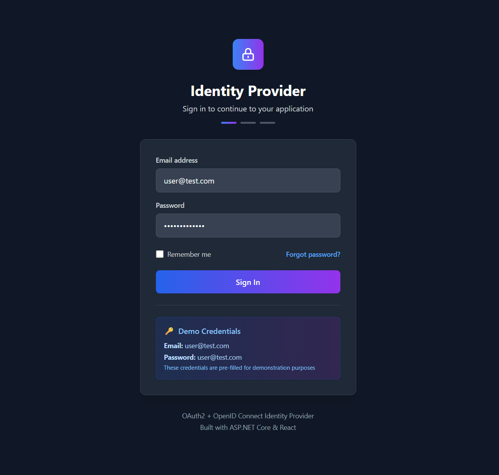

# Custom Identity Provider (OpenID Connect + OAuth 2.0)

A comprehensive Identity Provider implementation built from scratch to demonstrate understanding of OpenID Connect and OAuth 2.0 protocols. This project showcases modern web development practices with a Web API backend and React frontend.



## 🎯 Project Overview

This custom Identity Provider was built as a learning project to implement and understand the core concepts of:

- **OpenID Connect (OIDC)** authentication flows
- **OAuth 2.0** authorization framework
- **JWT** token generation and validation
- **PKCE** (Proof Key for Code Exchange) security
- **Cross-origin** authentication patterns
- **Modern web security** best practices

## 🔧 Technical Stack

- **Backend:** .NET 9 Web API with minimal APIs
- **Frontend:** React 18 + TypeScript + Vite
- **Styling:** Tailwind CSS
- **Authentication:** Custom OIDC/OAuth2 implementation
- **Security:** RSA JWT signing, PKCE, secure cookies

## 🚀 Features Implemented

### Core OIDC/OAuth2 Features
- ✅ Authorization Code Flow with PKCE
- ✅ JWT Access & ID Token generation
- ✅ Token introspection and validation
- ✅ User authentication and authorization
- ✅ Secure cookie-based sessions
- ✅ Cross-origin request handling

### Security Features
- ✅ RSA256 JWT signing
- ✅ PKCE (Proof Key for Code Exchange)
- ✅ Secure HTTP-only cookies
- ✅ CORS configuration
- ✅ Token expiration and cleanup

### Developer Experience
- ✅ OpenAPI/Swagger documentation
- ✅ Hot reload development setup
- ✅ Automated dependency management
- ✅ Comprehensive logging

## 🏗️ Architecture

The project follows clean architecture principles:

```
├── IdentityProvider.Api/          # Main API endpoints and configuration
└── IdentityProvider.Web.LoginPage/ # React frontend for user interface
```

### Key Components
- **Discovery Endpoint** - OIDC configuration discovery
- **Authorization Endpoint** - OAuth2 authorization flow
- **Token Endpoint** - Access token exchange
- **UserInfo Endpoint** - User profile information
- **JWKS Endpoint** - Public key discovery

## Quick Start

This repository includes PowerShell scripts to quickly start the project components:

### Individual Services

- **Start API Server Only:**
  ```powershell
  .\start-server.ps1
  ```
  Starts the .NET API server on `http://localhost:5043`

- **Start Web Frontend Only:**
  ```powershell
  .\start-web.ps1
  ```
  Starts the React frontend on `http://localhost:5173`

## 📋 Prerequisites

- .NET 9.0 SDK or later
- Node.js (v18 or higher)
- PowerShell (Windows) or any terminal

## 🔧 Manual Development Setup

If you prefer to start services manually for development:

### API Server
```bash
cd src/IdentityProvider.Api
dotnet restore
dotnet run
```

### Web Frontend
```bash
cd src/IdentityProvider.Web.LoginPage
npm install
npm run dev
```

## 📡 API Endpoints

### OIDC Discovery
- `GET /.well-known/openid-configuration` - OIDC configuration

### Authentication Flow
- `GET /authorize` - Authorization endpoint
- `POST /token` - Token exchange endpoint
- `GET /userinfo` - User information endpoint

### Utility Endpoints
- `GET /.well-known/jwks.json` - Public keys (JWKS)
- `GET /swagger` - API documentation (Development)

## 🎓 Learning Outcomes

This project demonstrates practical implementation of:

1. **OpenID Connect Protocol**: Complete OIDC flow from authorization request to token validation
2. **OAuth 2.0 Security**: PKCE implementation, secure token storage, and validation
3. **JWT Handling**: RSA key generation, token signing, and verification
4. **Web Security**: CORS handling, secure cookies, and cross-origin authentication
5. **Modern .NET**: Minimal APIs, dependency injection, and clean architecture
6. **Frontend Integration**: React SPA integration with backend authentication

## 🔐 Security Considerations

- **Production Ready**: Implements security best practices for authentication flows
- **PKCE Protection**: Prevents code interception attacks
- **Secure Cookies**: HTTP-only, SameSite protection
- **Token Management**: Automatic cleanup and expiration handling
- **CORS Configuration**: Proper cross-origin request handling

## Prerequisites

## 📂 Project Structure

```
├── src/
│   ├── IdentityProvider.Api/              # Main Web API
│   │   ├── Endpoints/                     # OIDC/OAuth2 endpoints
│   │   ├── Services/                      # Business logic services
│   │   ├── Configurations/                # Shared configurations
│   │   └── Models/                        # Data models
│   └── IdentityProvider.Web.LoginPage/    # React frontend
├── docs/                                  # Documentation
├── start-server.ps1                       # Server startup script
├── start-web.ps1                          # Frontend startup script
├── start-all.ps1                          # Combined startup script
└── stop-all.ps1                           # Stop all services script
```

## 🔧 Configuration

The Identity Provider uses configuration from:
- `appsettings.json` - Base configuration
- `appsettings.Development.json` - Development overrides

Key configuration sections:
- **JWT Settings**: RSA key configuration and token parameters
- **CORS Settings**: Allowed origins for cross-origin requests
- **OAuth Clients**: Registered client applications
- **Frontend URLs**: Login and logout redirect URLs
